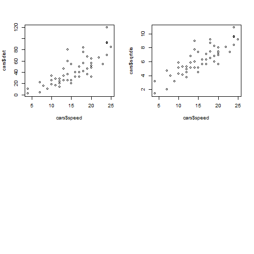

### Salient Features 


* Shiny application uses dataset cars to build a prediction model.
* App creates a model to calculate Distance required to stop car depending on its speed.
* Apps Asks user input for the speed at which their car is travelling.
* Uses Model to predict distance required to stop car at given speed.

--- &twocol

### Exploratory Analysis/Transformation

*** =left

 

*** =right


* Plot on left is distance v/s speed.
* Plot on right is sqrt of distance v/s speed.
* Plot on right looks more linear so we will do transformation of distance for our analysis

---

### Final Model


```
## 
## Call:
## lm(formula = sqrt(dist) ~ speed, data = cars)
## 
## Residuals:
##     Min      1Q  Median      3Q     Max 
## -2.0684 -0.6983 -0.1799  0.5909  3.1534 
## 
## Coefficients:
##             Estimate Std. Error t value Pr(>|t|)    
## (Intercept)  1.27705    0.48444   2.636   0.0113 *  
## speed        0.32241    0.02978  10.825 1.77e-14 ***
## ---
## Signif. codes:  0 '***' 0.001 '**' 0.01 '*' 0.05 '.' 0.1 ' ' 1
## 
## Residual standard error: 1.102 on 48 degrees of freedom
## Multiple R-squared:  0.7094,	Adjusted R-squared:  0.7034 
## F-statistic: 117.2 on 1 and 48 DF,  p-value: 1.773e-14
```

---

### Final Prediction


* Previous page displays summary of model we build.
* It predicts stopping distance in feet for cars at a given speed.
* In our shiny app We ask user to input speed of cars on left and provide distance required to stop as result.
* Final result obtained by multiplying speed with speed coefficient(.32241) and adding the intercept (1.277).
